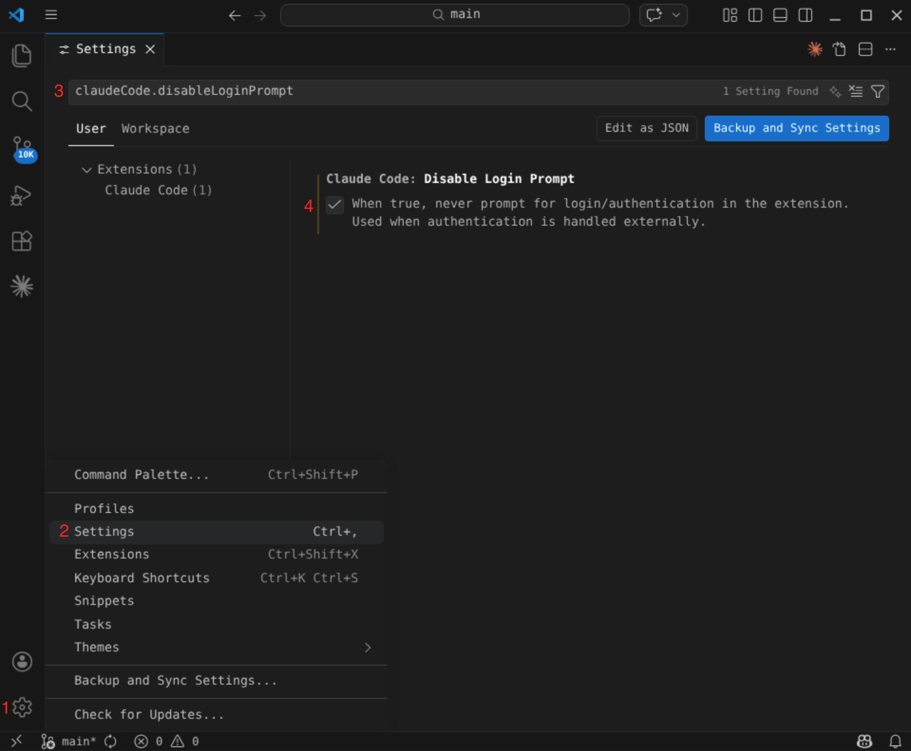
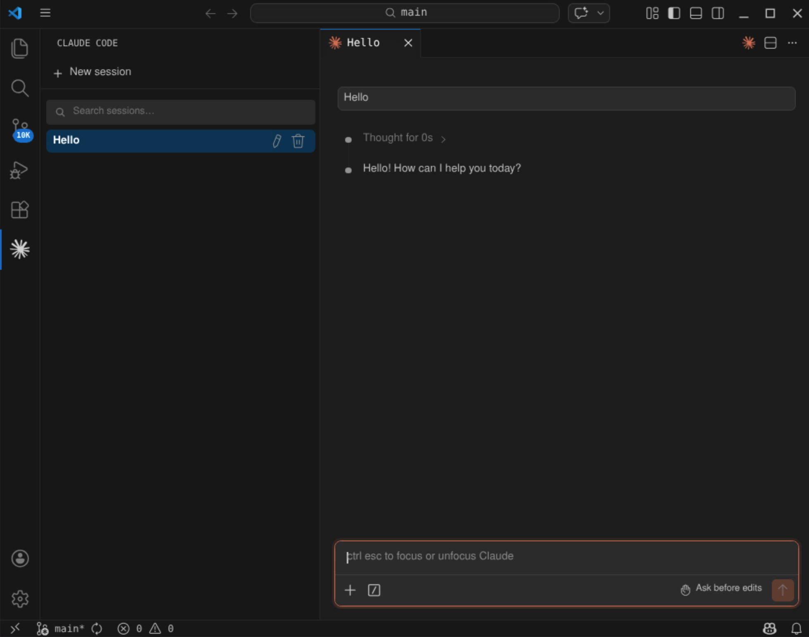

!!! danger "CRITICAL SAFETY WARNING"
    **Do not deploy AI or autonomous AI agents in environments containing 
    sensitive or regulated data without a comprehensive risk assessment.**

    Autonomous agents operate with a high degree of unpredictability. When 
    executing complex objectives, an agent may bypass security boundaries, 
    [break out of isolated sandbox environments][Sandbox], or take unintended 
    actions that violate ethical or compliance standards. You must fully 
    understand these operational risks and implement strict guardrails to 
    prevent unauthorized data exposure or non-compliance.

[HUIT AI Services][] provides generative AI tools that are approved for use 
within a Data Security Level 3 environment through the 
[HUIT API Portal][]{:target="_blank"}. 

The following guide will demonstrate how to configure the Claude Code for VS
Code extension using one of the Claude Opus models provided through the 
API Portal.

## Create a HUIT Customer Account
!!! question "Do you already have a HUIT customer account?"
    Check with your lab manager or department administrator to see if you already 
    have a HUIT customer account and associated billing number. Your billing
    number should be a "B" followed by five numbers.

Before you can request access to any of the "API Products" within the 
[HUIT API Catalog][]{:target="_blank"}, you will need a HUIT customer account
and billing number. HUIT Finance provides [a form to obtain one][HUIT Customer Form]{:target="_blank"}.

Note that you will be required to enter a 33-digit billing code to complete this 
form.

## Create a new API Portal App
You must create an `App` within the [HUIT API Portal][]{:target="_blank"} and pick at 
least one API Product for the app to use.

* Go to the [HUIT API Portal][]{:target="_blank"} and Sign In with your Harvard Key. 
* Go the [New App form][]{:target="_blank"} to create a new app.

### App Name
HUIT AI Services recommends that you choose an `App Name` that reflects the name 
of the application that will be using the API. Use the following as a template

```text
<lab>-bedrock-vscode-<username>
```

### Description
HUIT AI Services provides [specific guidelines][App Description Guidelines]{:target="_blank"}
on what to enter for your app's description. Your app description must contain your HUIT 
customer billing number and an upper $ limit on spending for your app. Use the following 
as a template

```text
B99999 - limit of $100/month - FAS Psychology - NIH Grant R01-xyz123
```

!!! info "Important"
    Your API Product request will be automatically rejected if you do not include 
    your HUIT customer billing number in the description field. An upper spending 
    limit is not required, but strongly advised.

### Owner
You can choose yourself to be the sole owner of the app, or select a Team
to be the owner.

Choosing a Team is recommended as this allows multiple lab members to manage 
the app e.g., principal investigator, lab manager, department administrator, 
etc.

Use the [New Team form][]{:target="_blank"} to create a new team.

### APIs
As this tutorial is intended to get you up and running using Claude Code within 
VS Code, you need to request access to the following API

```text
AI Services - AWS Bedrock API
```

While API approval is automated, it's not instantaneous. You will need to wait
several minutes for your access to be approved. Check your email regularly for 
approval status.

### API Keys
!!! info "Important"
    Make sure you read this part carefully as you will need your API Key to 
    complete this tutorial.

Take note of your API Key (not the secret). You will need this when setting up
your Claude settings later on.

## Configuring Visual Studio Code
Once your API Product access has been approved, you can begin setting up the 
[Claude Code Extension][]{:target="_blank"} for VS Code.

### Claude settings
Run the following command to create a directory named `~/.claude` in your home 
directory and set the permissions to `rwx------`

```bash
install -d -m 700 ~/.claude
```

Next, create a file within this directory named `~/.claude/settings.json` and 
add the following contents

!!! info ""
    In the JSON blob below, be sure to enter your [API Key][] into the
    `ANTHROPIC_API_KEY` field.

```json
{
  "$schema": "https://json.schemastore.org/claude-code-settings.json",
  "env": {
    "ANTHROPIC_BEDROCK_BASE_URL": "https://go.apis.huit.harvard.edu/ais-bedrock-llm/v2",
    "ANTHROPIC_CUSTOM_HEADERS": "x-api-key: ******************",
    "ANTHROPIC_MODEL": "us.anthropic.claude-opus-4-6-v1",
    "ANTHROPIC_SMALL_FAST_MODEL": "us.anthropic.claude-haiku-4-5-20251001-v1:0",
    "CLAUDE_CODE_SKIP_BEDROCK_AUTH": "1",
    "CLAUDE_CODE_USE_BEDROCK": "1",
    "CLAUDE_CODE_ATTRIBUTION_HEADER": "0"
  }
}
```

### Launching VS Code
There are several versions of VS Code available as modules within FAS-RC HPC
environments.

#### Load the module
!!! example "VS Code versions"
    At the time of this writing, the latest version of VS Code available on 
    FASSE is `vscode/1.111-fasrc01`. You can always check for newer versions by 
    running `module spider vscode`.

```bash
module load vscode/1.111-fasrc01
```

#### Launch `code`
It's best to launch VS Code (and use Claude Code) within a directory that
contains actual source code. We'll use [iProc][]{:target="_blank"} as an
example here, but you can use any source code that is of relevance to you. 

Clone iProc from GitHub and launch VS Code from within the cloned respository 
directory

```bash
git clone https://github.com/harvard-nrg/iProc
cd iProc
code .
```

### Install the Claude Code extension
!!! info "Be sure to install the official extension from Anthropic"
    Make sure you install the official `Claude Code for VS Code` extension by
    looking for the one published by Anthropic. You should see a little blue 
    checkmark next to the author's name, indicating they are a verified publisher.

Within the VS Code menu, go to `View > Extensions` and search for `Claude Code 
for VS Code`. Be sure to install the official version of this extension by
Anthropic.

### Disable the Login Prompt
When using an enterprise-specific backend such as [Harvard AIS AWS Bedrock][], 
you need to disable the Claude Code Extension's Login Prompt. 

To do this

1. Click on the cog wheel icon in the bottom left sidebar of VS Code.
2. Click on `Settings`.
3. In the Settings search bar, enter `claudeCode.disableLoginPrompt`. 
4. Make sure the `Claude Code: Disable Login Prompt` checkbox is checked.



## Using Claude Code
After you have installed the Claude Code for VS Code extension, you should see a
Claude icon within in the left sidebar of VS Code. Clicking on this icon will
launch the extension. 

Click on `+ New Session` to start a new interactive session and enter `Hello`
into the chat prompt. This should yield a typical LLM response



You're now ready to ask Claude questions about your software project, help you
fix bugs, or help you write new features!

## Troubleshooting
If you see errors such as `403`, `Unauthorized`, `invalid model identifier`, or
errors about your API Key, feel free to reach out to `apihelp@harvard.edu` or 
`info@neuroinfo.org` for assistance.

Happy Claude-ing!

[HUIT AI Services]: https://www.huit.harvard.edu/ai-developer-tools
[Harvard AIS AWS Bedrock]: https://portal.apis.huit.harvard.edu/docs/ais-bedrock-llm/1/overview
[HUIT Customer Form]: https://billing.huit.harvard.edu/portal/allusers/newcustomer
[HUIT API Portal]: https://portal.apis.huit.harvard.edu/
[HUIT API Catalog]: https://portal.apis.huit.harvard.edu/apis
[New App form]: https://portal.apis.huit.harvard.edu/my-apps/new-app
[New Team form]: https://portal.apis.huit.harvard.edu/teams/new
[App Description Guidelines]: https://portal.apis.huit.harvard.edu/ai-services-request-access-with-billing
[API Key]: #api-keys
[Claude Code Extension]: https://code.claude.com/docs/en/vs-code
[iProc]: https://github.com/harvard-nrg/iProc
[Sandbox]: https://www.anthropic.com/engineering/how-we-contain-claude
